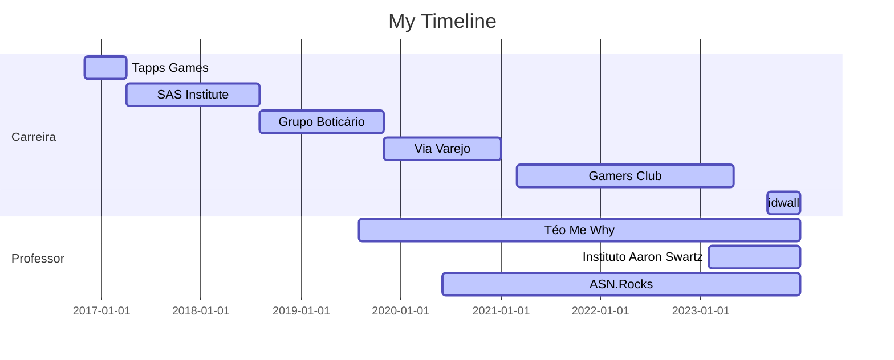

# Olá, eu sou o Téo

Que da hora ter você por aqui! :star_struck:
Aproveite para conhecer um pouco da minha jornada.

Téo Calvo, um entusiasta incansável do universo de dados, traz consigo uma rica jornada nas esferas de Data Science e Analytics. Como líder, destacou-se na condução estratégica de equipes, liderando pessoas e projetos de Advanced Analytics. Sua visão inovadora não apenas moldou a cultura organizacional, mas também impulsionou a implementação de um robusto Data Lake e a integração eficiente entre áreas cruciais da empresa.

Para além de suas realizações profissionais, Teo nutre uma paixão dedicada à democratização do conhecimento na área de dados e tecnologia. Por meio de sua iniciativa educacional, Téo Me Why, ele compartilha insights valiosos, promove treinamentos envolventes e disponibiliza material autoral, alcançando uma audiência global. Sua abordagem acessível e inspiradora tem impactado milhares de entusiastas, tornando o aprendizado sobre dados mais inclusivo e estimulante.

Skills: Python / SQL / Data Science / Machine Learning / Análise de dados
  

 
  
  
 	
   

----

## Participações

Em Eventos

:microphone: [Nubank DS & ML Meetup #81 | ML na Prática - Feature Stores](https://www.youtube.com/watch?v=mweKH03m5w4)

:microphone: [XP Educação | Data universe 5a Edição - Games, Dados e Ensino: Quais desafios temos nestes cenário?](https://www.youtube.com/watch?v=ztUwTXYbWrc)

:microphone: [Code Talk CACiC FCT-Unesp | Iniciando com Machine Learning](https://www.youtube.com/watch?v=GrVpFnxXQoY&ab_channel=CACiCFCT-Unesp)

Em Podcasts

:headphones: [Data talks #02 | TÉO CALVO - Carreira em Dados](https://www.youtube.com/watch?v=R6M6qREq7UU)

:headphones: [Stack - De Estatístico a Lider de Ciência de Dados](https://www.youtube.com/watch?v=SZETLgaf5dE)

:headphones: [Let's Data - Ep #13 Machine Learning nos games, live coding e hype dos dados](https://t.co/fplzqZEMQF?amp=1)

:headphones: [Produtei - Ep #04 Habilidades de Produtos: Dados](https://open.spotify.com/episode/3Eco6IrW3n9LRuc2Iv4q1F?si=DJ9J6guZSieFobkF1wP1_w&dl_branch=1)

:headphones: [Customer Centrismo Maio - Como as áreas de Data Science, Estatística e Machine Learning adentraram o Marketing](https://open.spotify.com/episode/7s15BGLgGM2PgIaquZ3DvM?si=inGnIt7BQUOYf0iVKvm2CA&dl_branch=1)

Em comunidades

:movie_camera: [DevTalks | Téo Me Why e Daniel HE4RT](https://www.youtube.com/watch?v=dbwpiG29o7k)

:movie_camera: [PET Elétrica UNESP - Primeiros passos com Machine Learning](https://www.youtube.com/watch?v=qzfS6m9uaWw)

:movie_camera: [Universidade dos Dados - Bate-papo com Téo Calvo (Head de Data e Streamer de Data Science)
](https://www.youtube.com/watch?v=7szLgsMBWoQ)

:movie_camera: [He4rt Talks #19 Precisa ser cientista para fazer Ciência de dados?](https://www.youtube.com/watch?v=APqLgsA4b14)

:movie_camera: [Curso-R Entrevista #2 | Téo Calvo](https://www.youtube.com/watch?v=TbwDeka1sUw)

:movie_camera: [AI Brasil - AI Talks #4 | Carreira, Streaming e Aprendizagem de Máquina - Téo Calvo](https://www.youtube.com/watch?v=jdqm-PeP6d4)

:movie_camera: [Taverna Dev #4 - Caroline Dantas e Teo Calvo - Data Science](https://www.youtube.com/watch?v=u9up5YeELYI)

:movie_camera: [marcobrunodev - #04 Qual stack de um Cientista de Dados? - Teo Calvo](https://www.twitch.tv/videos/598442109?collection=pVeek73lBhZBmQ)

:movie_camera: [EstaTiDados - Live Téo Calvo (Docente da ASN.Rocks) - Introdução de SQL e Python](https://www.youtube.com/watch?v=_-17Kx4Ah4A)

:movie_camera: [EstaTiDados - Parte 1 - Webscraping - Personagens Resident Evil - Python](https://www.youtube.com/watch?v=zAWN5dNDYSo)

:movie_camera: [EstaTiDados - Parte 2 - Webscraping - Personagens Resident Evil - Python](https://www.youtube.com/watch?v=tmA1dhW3XN0)

## Atuação profissional

:id: Data Science & Analytics Manager - idwall (09.2023 - 01.2024)

:video_game: Head of Data - Gamers Club (03.2021 - 05.2023)

:blue_book:	Professor - ASN.Rocks (06.2020 - Atual)

:shopping_cart:	 Coordenador de Customer Centric (Activation) - Via Varejo (11.2020 - 02.2021)

:shopping_cart:	 Consultor de Data Science - Via Varejo (11.2019 - 02.2020)

:lipstick: Analista de CRM - Grupo Boticário (08.2018 - 11.2019)

:computer: Consultor em Advanced Analytics - SAS Institute (01.2018 - 08.2018)

:computer: Consultor em Pré Vendas - SAS Institute (04.2017 - 01.2018)

:video_game: Data Scientist - Tapps Games (11.2016 - 04.2017)

## Formação Acadêmica

:newspaper_roll: Especialização em Big Data e Data Science - UFPR (2018 - 2019)

:newspaper_roll: [Bacharel em Estatística - FCT/UNESP (2010 - 2017)](https://github.com/TeoCalvo/TeoCalvo/blob/main/docs/tcc_teo_calvo_unesp_2017.pdf)
